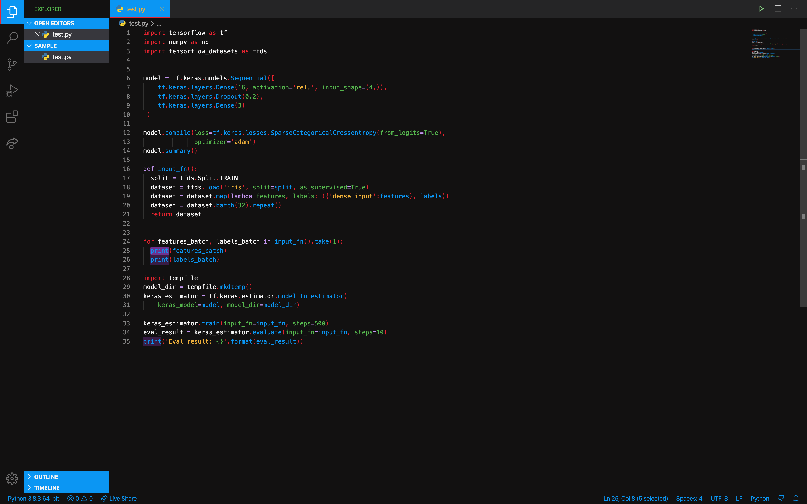
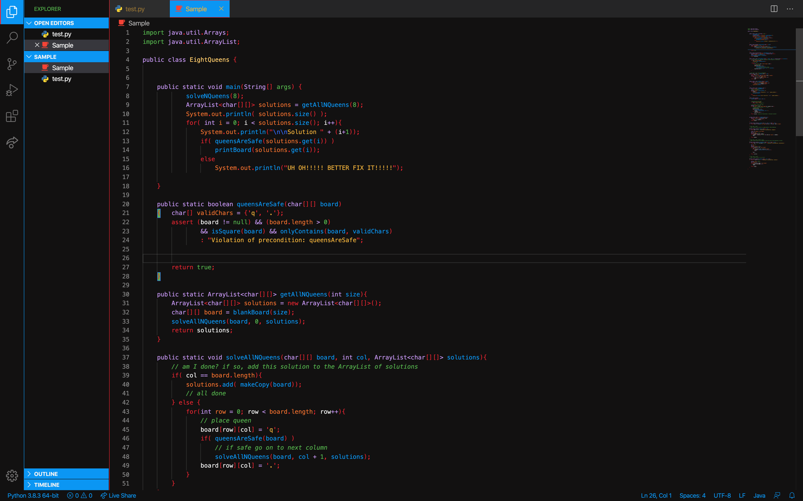
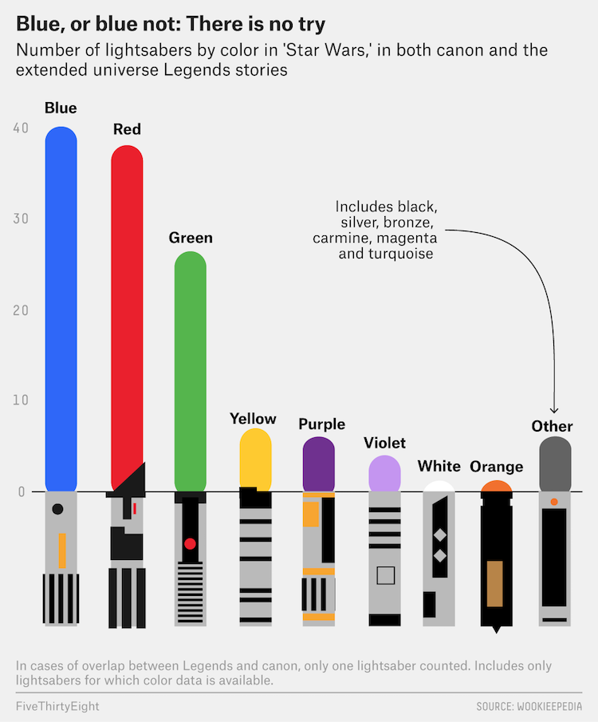

# Star Wars Theme
I sense a great disturbance in the code. 

 
"*One of the best code editor available in the market visual studio code is, yes.*" - Yoda  
In a galaxy far, far away, lives a lot of programmers using the force to create beautiful pieces of code. So, for all my fellow Jedi and Sith coders, I am presenting the STAR WARS THEME for Visual Studio Code. With a beautiful blend of all the lightsaber colours, it's time to bring balance in the code.

## Sample Images

 

## Installation Procedure
- Download and Install the latest version of [Visual Studio Code](https://code.visualstudio.com/download)
- Launch Visual Studio Code
- Bring up the Extensions View by clicking on the Extensions icon in the Activity Bar on the side of VS Code or by using the shorcut `CMD+Shift+X` on a mac or `CTRL+Shift+X` on Windows
- Click on the search tab and search for `Star Wars Theme`
- Click on the install button to install the Star Wars Theme
- The theme should automatically apply. If not, then follow the following procedure.
- Reload Visual Studio Code
- Use the keyboard shortcut `CMD+Shift+P` on a mac or `CTRL+Shift+P` on Windows to open the command palette
- search for `Preferences: Color Theme` and click enter
- select `Star-Wars-Theme` from the drop down

## Credit
This image was used to get the colour palette for all the lightsabers.
Credit to the owner of the photo.

### May the Force be with you, Always!
